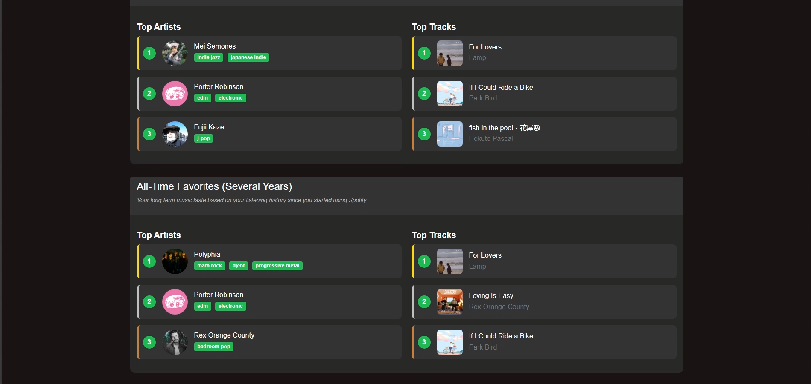

<section id="about" class="section">

## About Me

  
  

    
Hello! I'm Edgar, a computer science graduate based in Houston, Texas. I enjoy guitar, animals, and nature.

    
I'm passionate about building web applications and exploring data visualization. Currently seeking opportunities to grow my skills in software development.

  

</section>

---

<section id="skills" class="section">

## Skills

  

    <h3>Languages</h3>
    <ul>
      <li>Python</li>
      <li>C++</li>
      <li>Java</li>
    </ul>
  

  
  

    <h3> Web Technologies</h3>
    <ul>
      <li>HTML</li>
      <li>CSS</li>
      <li>JavaScript</li>
    </ul>
  

  
  

    <h3>Databases</h3>
    <ul>
      <li>MySQL</li>
    </ul>
  

  
  

    <h3>Tools & Platforms</h3>
    <ul>
      <li>Git</li>
      <li>GitHub</li>
      <li>VS Code</li>
    </ul>
  

</section>

---

<section id="projects" class="section">

## Projects

  

    
  

  

    <h3>Spotify Data Visualizer</h3>
    
<strong>Technologies:</strong> HTML, Python

    
<strong>Duration:</strong> Jan 2025 - May 2025

    
A web application that visualizes Spotify listening data, providing insights into music preferences and listening habits.

    <a href="https://github.com/EdgarHuynhGit/SpotifyDataVisualizer" class="project-link" target="_blank">View Project →</a>
  

<!-- Add more projects here following the same pattern -->

</section>

---

<section id="contact" class="section">

## Contact Me

  
I'm always interested in new opportunities and collaborations. Feel free to reach out!

  
  

    <a href="mailto:huynhedgar@gmail.com" class="contact-item">
      📧
      huynhedgar@gmail.com
    </a>
    
    <a href="https://linkedin.com/in/edgarkhuynh" class="contact-item" target="_blank">
      LinkedIn Profile
    </a>
    
    <a href="https://github.com/EdgarHuynhGit" class="contact-item" target="_blank">
      GitHub Profile
    </a>
  

</section>

<footer class="site-footer">
  
&copy; 2025 Edgar Huynh. Built with Jekyll and GitHub Pages.

</footer>
